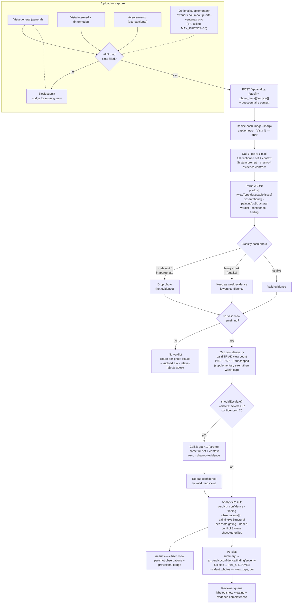

# AI Analysis Flow — Defect Triad Redesign

> Status: **proposed** (pending review before implementation)
> Supersedes the per-photo isolated analysis in `api/analysis/handlers.ts`.

## Why

The current pipeline analyzes **each photo independently** (`gpt-4.1-mini` per image,
escalate per image), produces one verdict per photo, then takes the worst. The subject
matter expert rejected this: a crack assessment needs **three complementary views of one
defect** — pull back for room context, the full wall, and a close-up to tell *paint flaw*
from *structural crack*. That distinction only emerges when the views are reasoned about
**together**. The AI's job is to **pre-analyze with full context**, not to issue isolated
per-image reports.

## Core reframe

The unit of analysis moves from **photo → defect**. One submission = one defect, evidenced
by a **required typed triad** plus optional supplementary photos, producing **one
contextual verdict** from a single multi-image call.

### Vocabulary (already defined in the codebase)

Required triad — reuses `IDEAL_SEQUENCE` (`components/home/home-client.tsx`):

| # | View type      | Label (sub)                    |
|---|----------------|--------------------------------|
| 1 | `general`      | Vista general (elemento completo) |
| 2 | `intermedia`   | Vista intermedia (zona del daño)  |
| 3 | `acercamiento` | Acercamiento (con referencia de tamaño) |

Optional supplementary — reuses `PHOTO_GUIDE`: `exterior`, `columna`, `puerta-ventana`, `otro`.
Ceiling stays `MAX_PHOTOS = 10` (3 triad + ≤7 supplementary).

## Key decisions

| # | Decision |
|---|----------|
| Unit | 1 submission = 1 defect = 1 triad → 1 verdict, single multi-image call. |
| Capture | `/upload` = 3 required typed slots + optional supplementary; all 3 triad views required to submit. |
| Payload | `fotos[]` + index-aligned `photo_meta` JSON `[{tier, type}]`, Zod-validated. |
| Model | Keep mini→strong escalation ladder, but **each pass sees the full captioned set + questionnaire context**. |
| Gating | **One call** returns per-photo `{viewType, tier, usable, issue}` **and** the verdict. |
| Invalid photos | Quality issues (blurry/dark) **degrade**; irrelevant/inappropriate are **dropped**; verdict **aggregates over valid views**. |
| Evidence floor | **≥1 valid view** of any type still yields a verdict (annotated "based on N of 3 views"). |
| Confidence cap | Capped by valid **triad**-view count: 1≈50, 2≈75, 3=uncapped. Supplementary photos strengthen *within* the cap, never lift it. |
| Escalation | Existing `shouldEscalate` (severe OR confidence < 70) reused → thin evidence auto-escalates to the strong model. |
| Prompt contract | Structured chain-of-evidence: `observations[]` per valid photo + `paintingVsStructural` (close-up substrate-vs-paint judgment) emitted **before** `verdict`. |
| Persistence | Full blob → existing `raw_ai` JSONB (no incidents migration); add `view_type` + `tier` columns to `incident_photos`. |

## Flow



## Output schema (chain-of-evidence)

The verdict is **conditioned on** the cross-view reading — `observations[]` and
`paintingVsStructural` are emitted *before* `verdict`, so the model must read each view
before concluding.

```jsonc
{
  "photos": [
    { "viewType": "general",      "tier": "triad", "usable": true,  "issue": null },
    { "viewType": "intermedia",   "tier": "triad", "usable": true,  "issue": null },
    { "viewType": "acercamiento", "tier": "triad", "usable": false, "issue": "blurry" }
  ],
  "observations": [
    { "viewType": "general",    "seen": "Sala con grieta diagonal en muro norte." },
    { "viewType": "intermedia", "seen": "Grieta de ~1m que cruza junta muro-techo." }
  ],
  "paintingVsStructural": "La grieta atraviesa el sustrato, no solo la capa de pintura.",
  "verdict": "severe",
  "confidence": 72,
  "finding": "Grieta estructural diagonal en muro portante; evacuar hasta reparación."
}
```

## Consequences

- **Removes** `perPhoto: PhotoResult[]` (per-photo *verdicts*) — replaced by descriptive
  `observations[]` + per-photo gating. Update `lib/assessment.ts`, `api/lib/schemas.ts`,
  and `/results` consumers.
- `/upload` becomes a **breaking UX change** (flat list → required typed slots). The home
  page already promises this exact sequence, so the change is aligned, not novel.
- One small migration on `incident_photos` (`view_type`, `tier`); no `incidents` migration.

## Deferred (not blockers)

1. **Image `detail` for the Acercamiento** — `detail:"low"` at 768px may blur the crack
   texture `paintingVsStructural` depends on; consider `detail:"high"` for the close-up
   during prompt tuning.
2. **Failed-submission UX** — copy/layout for "retake the blurry Acercamiento" vs. "we
   dropped an irrelevant photo." Frontend-only, designed during implementation.
